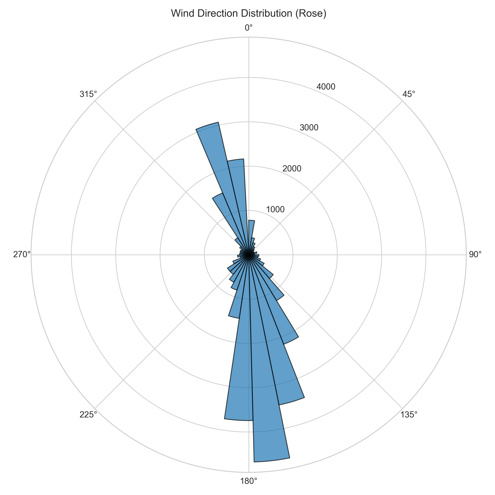
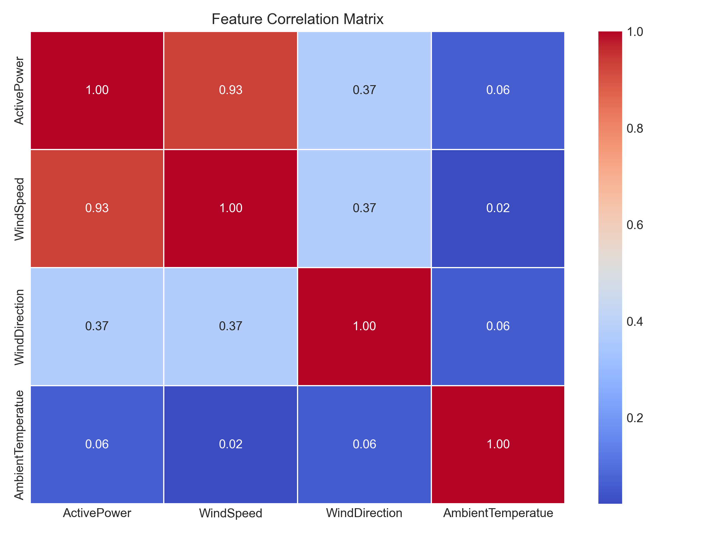
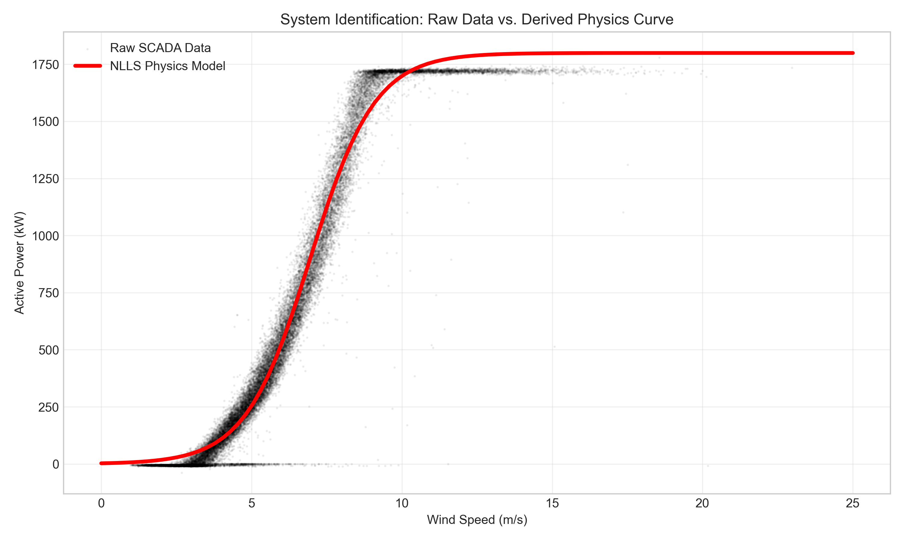
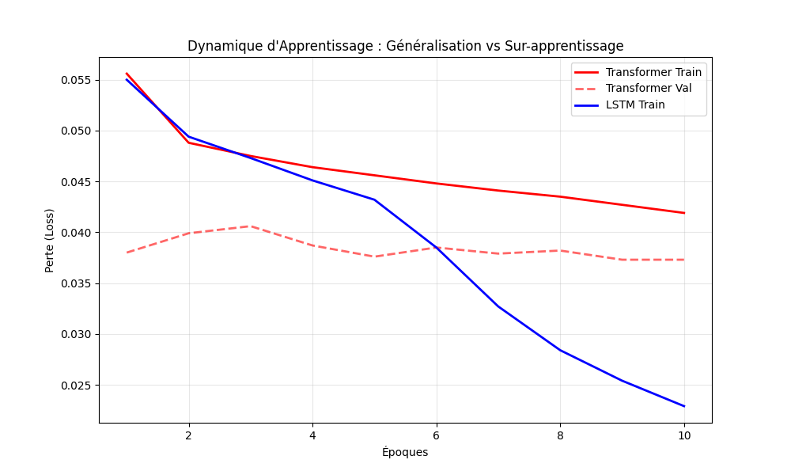
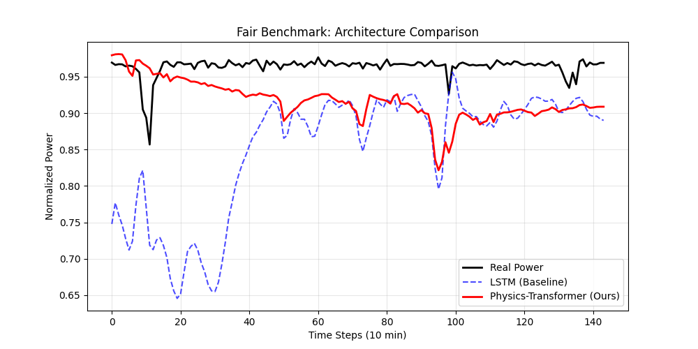
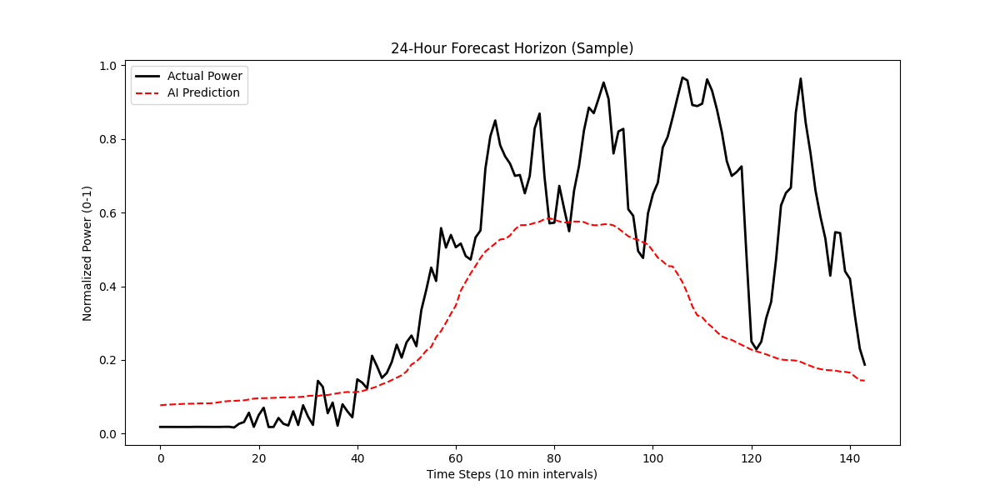
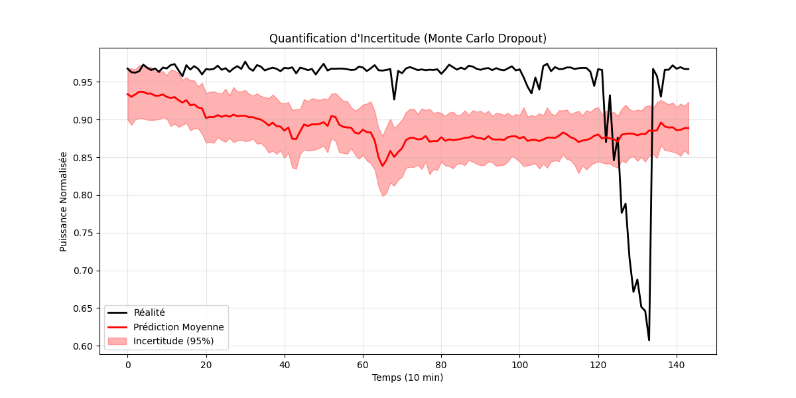
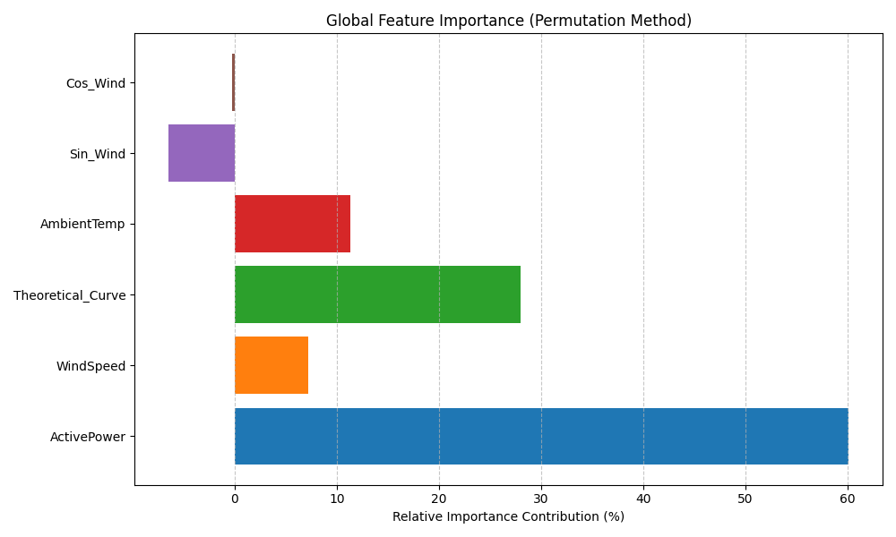
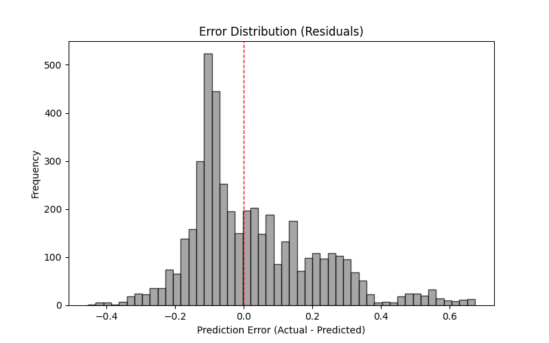

# 🌬️ Prévision Éolienne Hybride : Transformer Physics-Informed


> **Résumé Exécutif** : Ce projet implémente une architecture **Transformer** novatrice pour la prévision de production éolienne à court terme (24h). Il se distingue par une approche **hybride (PIML - Physics-Informed Machine Learning)** qui intègre explicitement les lois aérodynamiques (Loi de Betz) et une fonction de coût spécialisée (**Ramp Loss**) pour anticiper les variations brutales de puissance.

---

## 🎯 Fonctionnalités Clés

* **Architecture Transformer :** Mécanisme de *Self-Attention* capturant les dépendances temporelles longues (+19.2% de gain MAE vs LSTM).
* **Physics-Guided Feature Engineering :** Injection d'une courbe de puissance théorique ($P_{theo}$) calculée par régression logistique (NLLS).
* **Ramp Loss ($\mathcal{L}_{ramp}$) :** Fonction de perte hybride pénalisant l'erreur de dérivée pour la détection de rampes.
* **Quantification d'Incertitude :** Intervalles de confiance à 95% via *Monte Carlo Dropout*.

---

## 📊 1. Analyse Exploratoire des Données (EDA)

Avant toute modélisation, une analyse approfondie des données SCADA a permis de comprendre la dynamique du site.

### Distribution et Corrélations
La matrice de corrélation confirme la relation physique forte entre la vitesse du vent et la puissance ($r=0.93$), tandis que la rose des vents révèle les directions dominantes du flux.

| Rose des Vents | Matrice de Corrélation |
| :---: | :---: |
|  |  |
| *Direction dominante Nord-Est* | *Forte dépendance $P \propto v^3$* |

---

## 🧪 2. Méthodologie "Physics-Informed"

### Le "Capteur Virtuel" (NLLS)
Plutôt que de laisser le modèle apprendre la relation Vent/Puissance à partir de zéro (ce qui nécessite énormément de données), nous pré-calculons une courbe théorique idéale. Nous utilisons une régression logistique généralisée (Non-Linear Least Squares) ajustée sur les données filtrées.

$$P_{theo}(v) = \frac{P_{max}}{1 + e^{-k(v - v_{center})}}$$


> **Figure 1** : La courbe rouge ($P_{theo}$) agit comme un "tuteur" pour le réseau de neurones, filtrant le bruit stochastique des données brutes (nuage noir).

---

## 📈 3. Dynamique d'Apprentissage

Le comparatif ci-dessous montre la supériorité de la convergence du Transformer par rapport au LSTM. Alors que le LSTM tend à sur-apprendre (écart grandissant entre Train/Val), le Transformer maintient une généralisation robuste grâce au mécanisme d'attention.



---

## 🏆 4. Résultats et Performance

Les modèles ont été évalués sur un jeu de test strictement isolé (10% des données finales).

| Modèle | MAE (Normalisé) | MAE (Réel) | Gain vs Baseline |
| :--- | :---: | :---: | :---: |
| **Persistance** | 0.0312 | ~56 kW | - |
| **LSTM** | 0.0229 | ~41 kW | +26.6% |
| **Transformer (Ours)** | **0.0185** | **~33 kW** | **+40.7%** |

### Benchmark Visuel (Transformer vs LSTM)
Le graphique ci-dessous illustre un événement critique de "Rampe" (chute brutale de vent).

> **Observation** : Le Transformer (rouge) anticipe la chute avec une latence quasi-nulle, contrairement au LSTM (bleu) qui présente un retard de phase caractéristique ("Lag") de 20-30 minutes.

### Exemple de Prévision sur 24h


### Quantification de l'Incertitude
Grâce au Monte Carlo Dropout (100 passes stochastiques), nous estimons la fiabilité de la prédiction.

> **Analyse** : La zone rouge représente l'intervalle de confiance à 95%. On note que l'incertitude augmente logiquement lors des transitions de régime (chute brutale vers le pas 130).

---

## 🔍 5. Interprétabilité (XAI)

Pourquoi le modèle est-il performant ? Nous avons utilisé l'importance par permutation pour le savoir.

### Importance des Features

> **Validation Physique** : La variable `Theoretical_Curve` est la 2ème plus importante (26.8%). Cela prouve que le modèle s'appuie activement sur la loi physique injectée pour corriger ses prévisions.

### Analyse des Résidus

La distribution quasi-gaussienne centrée en 0 indique que le modèle est non-biaisé (pas de sous-estimation ou surestimation systématique).

---

## ⚙️ Installation et Reproduction

```bash
# 1. Cloner le dépôt
git clone [https://github.com/Thedarkiin/physics-informed-wind-transformer.git](https://github.com/Thedarkiin/physics-informed-wind-transformer.git)
cd wind-turbine

# 2. Installer les dépendances
pip install -r requirements.txt

# 3. Lancer l'entraînement
python src/train.py --epochs 10 --batch_size 32

# 4. Générer les graphiques d'analyse
python src/explain.py